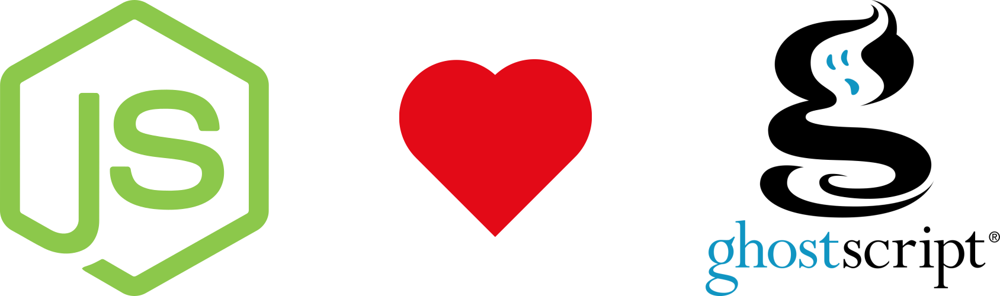

# Ghostscript4JS 
## This module binds the Ghostscript C API to bring its power to the Node.JS world

* [Introduction](#introduction)
* [Motivations](#motivations)
* [Prerequisites](#prerequisites)
* [Installation](#install)
* [Usage](#usage)
* [Team](#team)
* [Acknowledgements](#acknowledgements)
* [License](#license)

## Introduction

**Ghostscript** is a suite of software based on an interpreter for Adobe Systems' PostScript and Portable Document Format (PDF)
page description languages. Its main purposes are the rasterization or rendering of such page description language files,
for the display or printing of document pages, and the conversion between PostScript and PDF files.

Ghostscript can be used as a raster image processor (RIP) for raster computer printers—for instance, as an input filter
of line printer daemon—or as the RIP engine behind PostScript and PDF viewers.

Ghostscript can also be used as a file format converter, such as PostScript to PDF converter. The **ps2pdf** conversion program,
which comes with the ghostscript distribution, is described by its documentation as a "work-alike for nearly all the functionality
(but not the user interface) of Adobe's Acrobat Distiller product".[3] This converter is basically a thin wrapper around
ghostscript's pdfwrite output device, which supports PDF/A-1 and PDF/A-2 as well as PDF/X-3 output.[3]

Ghostscript can also serve as the back-end for **PDF** to **raster image** (png, tiff, jpeg, etc.) converter; this is often
combined with a PostScript printer driver in "virtual printer" PDF creators.[citation needed]

As it takes the form of a language interpreter, Ghostscript can also be used as a general purpose programming environment.

Ghostscript has been ported to many operating systems, including Unix-like systems, classic **Mac OS**, **OpenVMS**, **Microsoft Windows**,
**Plan 9**, **MS-DOS**, **FreeDOS**, **OS/2**, **Atari TOS and AmigaOS**.

### More resource and info about Ghostscript

* [Introduction to Ghostscript](https://www.gnu.org/software/ghostscript/intro.html)

* [Ghostscript on Wikipedia](https://en.wikipedia.org/wiki/Ghostscript)

* [Ghostscript documentation](https://www.ghostscript.com/Documentation.html)

## Motivations

At time i created this module i do not able to find any module on npm that execute Ghostscript command through its C API,
otherwise there are some module that call Ghostscript through the execution of the corresponding shell command. This is
good way to start use some library from node, but there are the following drawbacks:

* **Performance** - The call to the shell command take more time and more resources than call a library C or C++ API directly

from Node.js environment.

* **Errror handler** - Sometimes you cannot intercept and handle errors in a good and proper way.

To fit all needs Ghostscript4JS has sync and async method so it could be used in a web application where it's very important
to not block the event loop, so all request will be served whiout any delay originated by our application.

[Understanding Node.js event loop](https://nodesource.com/blog/understanding-the-nodejs-event-loop/)

## Prerequisites

Before install Ghostscript4JS youe need to assure you have been installed the following preequisites:

* Install **Node.JS** see: [Installing Node.js via package manager](https://nodejs.org/en/download/package-manager/)

* Install **Node.js native addon build tool** see: [node-gyp](https://github.com/nodejs/node-gyp)

* Install **Ghostscript** for your Operating System.
  * [Installation from official documentation](https://ghostscript.com/doc/current/Install.htm)
  * [Download](https://ghostscript.com/download/gsdnld.html)

## Installation

## Usage

## The Team

### Nicola Del Gobbo

<https://github.com/NickNaso/>

<https://www.npmjs.com/~nicknaso>

<https://twitter.com/NickNaso>

## Acknowledgements

Thank you to all people that encourage me every day.

## License

Licensed under [Apache license V2](./LICENSE)